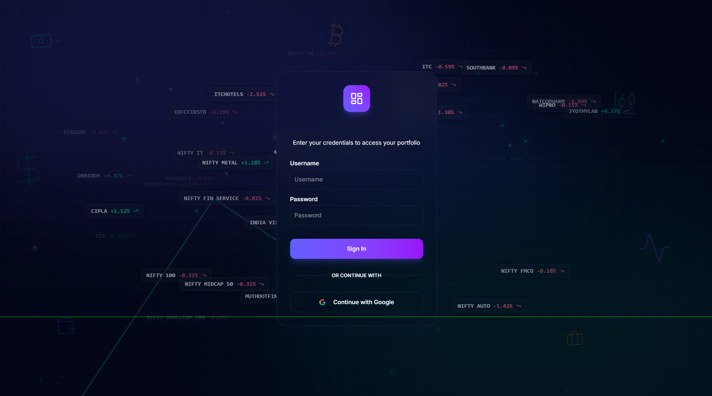
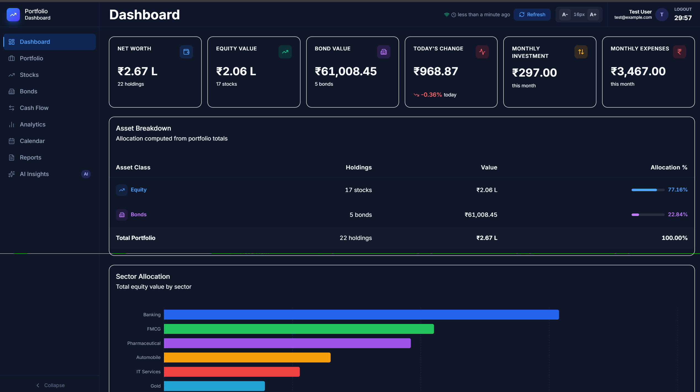
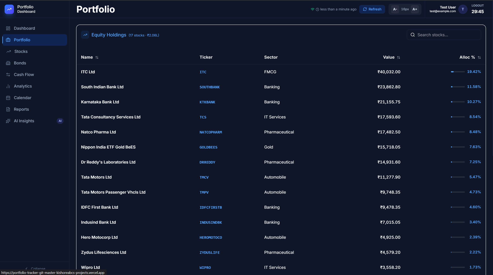
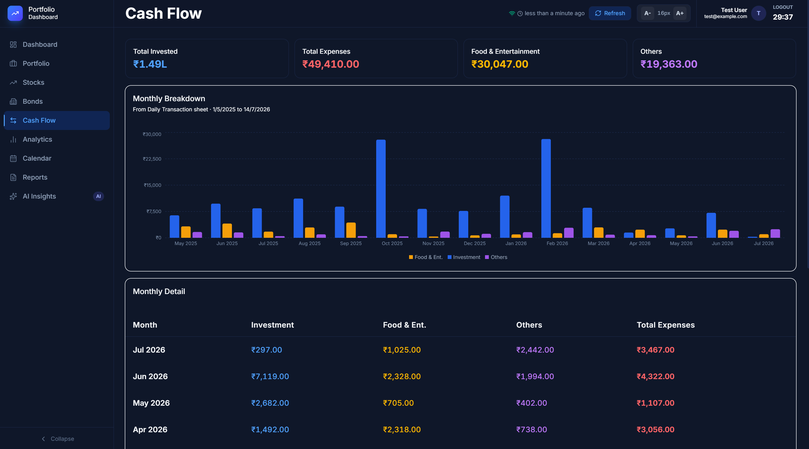
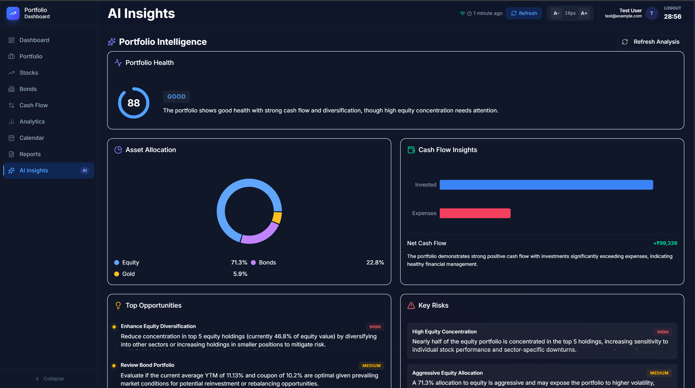

# 📈 Portfolio Tracker Dashboard

> A modern, high-performance financial dashboard built with Next.js to track, visualize, and analyze your investment portfolio.

**🚀 Live Demo:** [https://portfolio-tracker-kishoreabcs-projects.vercel.app/](https://portfolio-tracker-kishoreabcs-projects.vercel.app/) — *To experience its full potential, try it out!*
*(Demo credentials are hidden inside this file. Read fully to get access)*
**📊 Reference Data:** [Google Sheet Template](https://docs.google.com/spreadsheets/d/1uDp-iC8BJYWLzDHcuPv1Go40Pikkt24OBH58G4ewYOU/edit?usp=sharing)


## Overview

**What the project does**: The Portfolio Tracker Dashboard is a comprehensive web application that aggregates financial data across various asset classes (Equities, Bonds) and presents it in a unified, visually appealing interface. It integrates directly with a read-only Google Sheets database and utilizes Google's Gemini AI to provide intelligent insights.

**Why it was built**: To provide a centralized, privacy-focused, and highly customizable alternative to generic portfolio trackers, allowing the user to maintain full control over their financial data within Google Sheets while enjoying a premium dashboard experience.

**The problem it solves**: Managing investments across different brokers and asset classes often leads to fragmented data. This dashboard solves the problem by acting as a single pane of glass for net worth, asset allocation, performance analytics, and cash flow.

**The target users**: Individuals who already track their investment and financial details in Google Sheets and need a powerful, automated way to visualize and analyze that data.

**The main objectives**: 
- Deliver a fast, responsive, and beautiful user interface.
- Provide actionable insights through AI and rich visualizations.
- Ensure strict read-only access to source data for security.

> [!NOTE]
> **Developer Disclaimer: The Power of "Vibe Coding"**
> This project was brought to life relying entirely on AI-assisted "vibe coding." While I possess only a basic, foundational understanding of full-stack development, the entire architecture, component structuring, Next.js integration, and complex UI interactions were orchestrated by directing AI tools. 
> 
> My primary role was shaping the vision, defining the user experience, structuring the data integrations, and dictating the overall "vibe" of the solution. The AI acted as the execution engine for writing the boilerplate, handling state management, and refining the visual details. As such, this repository stands as a testament to what is possible when fundamental domain knowledge meets modern AI-driven development workflows!

---

## Features

### Core Features
- **Holistic Dashboard**: At-a-glance view of net worth, daily changes, and high-level allocation.
- **Equities Management**: Track stock holdings, real-time price movements, and sector allocations.
- **Bonds Management**: Monitor fixed-income assets, upcoming maturities (bond ladder), and credit ratings.
- **Cash Flow Tracking**: Daily transaction log integration for income and expenses tracking.
- **Reports Export**: Generate CSV reports of portfolio holdings.

### Advanced Features
- **AI Insights**: Contextual portfolio analysis powered by Google's Gemini 2.5 API.
- **Dynamic Data Discovery**: Intelligent parsing of Google Sheets tabs without hardcoded column dependencies.
- **Advanced Filtering & Sorting**: Sort holdings by value, maturity, YTM, price change, and more.

### Security Features
- **NextAuth Integration**: Secure OAuth-based authentication (Google Provider).
- **Server-Side API Calls**: Google Sheets and Gemini API keys are never exposed to the client browser.
- **Read-Only Data Access**: Strict GET-only operations to prevent accidental data corruption.

### Performance Features
- **React Query Caching**: Smart 15-minute data caching to minimize API calls and improve load times.
- **Server Components**: Leverages Next.js App Router for optimal rendering performance.
- **Virtualized Tables**: Efficient rendering for large datasets of holdings.

### UI/UX Features
- **Modern Dark Mode**: Sleek design utilizing Tailwind CSS and Shadcn UI.
- **Interactive Visualizations**: Responsive charts (Pie, Treemap, Bar) built with Recharts.
- **Smooth Animations**: Buttery-smooth micro-interactions powered by Framer Motion.
- **Command Palette**: Global search and quick navigation via `cmdk`.

### Future-ready Features
- **Extensible Parsers**: Built-in generic heuristic parsers for adding new asset classes (e.g., Mutual Funds) effortlessly.

---

## Tech Stack

| Category | Technology | Purpose |
|----------|------------|---------|
| **Frontend** | Next.js 16 (App Router), React 19 | Core framework and UI library. |
| **Backend** | Next.js Route Handlers | Server-side API endpoints for fetching data and AI. |
| **Database** | Google Sheets API v4 | Read-only data source acting as the database. |
| **Authentication** | Auth.js (NextAuth v5 beta) | Secure session management and Google OAuth. |
| **APIs** | Google Sheets API, Gemini API | Data retrieval and AI-driven insights generation. |
| **State Management**| React Query | Client-side data fetching, caching, and synchronization. |
| **Styling** | Tailwind CSS v4 | Utility-first CSS framework for rapid styling. |
| **UI Components** | Shadcn UI, Radix UI | Accessible, customizable pre-built components. |
| **Animations** | Framer Motion | Advanced UI animations and transitions. |
| **Charts** | Recharts | Composable charting library for data visualization. |
| **Build Tools** | Webpack/Turbopack | Next.js native build system. |
| **Package Manager**| npm | Dependency management. |
| **Testing** | Not implemented | - |

---

## Project Architecture

The architecture is designed around a **Next.js 16 App Router** pattern, separating client-side interactivity from secure server-side operations.

**Overall Architecture**: 
The app is a full-stack Next.js application. The frontend communicates with Next.js Route Handlers (`/api/*`), which in turn securely interface with external APIs (Google Sheets and Gemini). 

**Folder Structure**:
The project is strictly organized into `app`, `components`, `hooks`, `lib`, and `types` directories to enforce separation of concerns.

**Component Interactions**:
Pages (e.g., Dashboard, Portfolio) use custom hooks like `usePortfolioData` (wrapping React Query) to request data. The UI components (Charts, Tables, KPIs) receive this data via props to remain pure and reusable.

**Data Flow**:
1. Client requests data via React Query hook.
2. Next.js Route Handler `/api/sheets` is hit.
3. Server fetches raw CSV/gviz data from Google Sheets API using the server-side key.
4. Data is run through the `lib/sheets/parser.ts` heuristic parser.
5. Parsed data is passed to `lib/mappers/*` to enforce TypeScript interfaces.
6. Structured JSON is returned to the client and cached.

**Request Lifecycle**:
All user requests are first intercepted by `middleware.ts` to ensure the user is authenticated via NextAuth before accessing the dashboard routes.

**Authentication Flow**:
OAuth 2.0 flow via Google. NextAuth issues a secure JWT session cookie upon successful login, protecting all internal dashboard pages.

**Database Interaction**:
The "Database" is purely read-only via Google Sheets. No write operations (`APPEND`, `UPDATE`) are permitted by design.

---

## Folder Structure

```
── dashboard/
    ├── app/                  # Next.js App Router (Pages, Layouts, API Routes)
    │   ├── analytics/        # Analytics view
    │   ├── api/              # Route Handlers (sheets, insights)
    │   ├── bonds/            # Bonds specific view
    │   ├── calendar/         # Upcoming maturities/events
    │   ├── cashflow/         # Cashflow tracking
    │   ├── insights/         # AI Insights page
    │   ├── login/            # Authentication page
    │   ├── portfolio/        # Unified holdings table
    │   ├── reports/          # PDF/CSV Export page
    │   └── stocks/           # Equity specific view
    ├── components/           # Reusable UI elements
    │   ├── charts/           # Recharts visualization wrappers
    │   ├── layout/           # Sidebar, Topbar, App Shell
    │   ├── shared/           # KPIs, Badges, standard widgets
    │   └── ui/               # Shadcn UI primitives
    ├── hooks/                # React Query hooks (usePortfolioData, useAiInsights)
    ├── lib/                  # Core Business Logic
    │   ├── calc/             # Portfolio math (allocation, risk)
    │   ├── mappers/          # Data normalizers for raw Google Sheet rows
    │   └── sheets/           # Google Sheets discovery and heuristic parsing
    ├── types/                # TypeScript interface definitions (holdings, bonds, etc.)
    ├── .env.local            # Environment variables (not committed)
    ├── components.json       # Shadcn UI configuration
    ├── eslint.config.mjs     # Linter configuration
    ├── next.config.ts        # Next.js framework configuration
    ├── package.json          # Project dependencies and scripts
    ├── postcss.config.mjs    # Tailwind/PostCSS configuration
    └── tsconfig.json         # TypeScript compiler options
```

---

## Installation

Follow these exact steps to run the project locally.

### 1. Clone repository
```bash
git clone <repository-url>
cd "Portfolio Tracker/dashboard"
```

### 2. Install dependencies
```bash
npm install
```

### 3. Environment variables
Create a `.env.local` file based on the example:
```bash
cp env_example.txt .env.local
```
Fill in your specific API keys in `.env.local` (see Environment Variables section below).

### 4. Database setup
Ensure your Google Sheet is accessible (either via "Anyone with the link can view" or by granting access to the Google Cloud Service Account tied to your `GOOGLE_SHEETS_API_KEY`).

### 5. Build (Optional for local dev)
```bash
npm run build
```

### 6. Start development server
```bash
npm run dev
```
Open [http://localhost:3000](http://localhost:3000) in your browser.

### 7. Production build
```bash
npm run build
npm run start
```


## Environment Variables

| Variable | Required | Description | Example |
|----------|----------|-------------|---------|
| `GOOGLE_SHEET_ID` | Yes | The ID of the Google Sheet (found in the URL) | `1MtaaNph6dCmSM4WVF5d...` |
| `GOOGLE_SHEETS_API_KEY` | Yes | API Key with access to Google Sheets API | `AIzaSyB...` |
| `GEMINI_API_KEY` | Optional | Google Gemini API key for AI Insights page | `AIzaSyC...` |
| `AUTH_SECRET` | Yes | NextAuth encryption secret (`npx auth secret`) | `super_secret_string` |
| `AUTH_URL` | Yes | Base URL of the application | `http://localhost:3000` |
| `GOOGLE_CLIENT_ID` | Yes | Google OAuth Client ID | `12345.apps.googleusercontent.com`|
| `GOOGLE_CLIENT_SECRET`| Yes | Google OAuth Client Secret | `GOCSPX-...` |
| `ALLOWED_EMAILS` | Yes | Comma-separated list of emails allowed to log in | `example@gmail.com, test@example.com` |

---

## Usage

1. **Login**: Navigate to the site and authenticate. For the live demo, use Username: `test` and Password: `test`.
2. **Main Workflows**: 
   - **Dashboard**: View high-level metrics (Net Worth, total equities, total bonds).
   - **Data Sync**: The app automatically fetches from your Google Sheet. Click the "Refresh Data" button to bypass the 15-minute cache.
3. **User Actions**:
   - **Analyze**: Go to the Analytics or Insights tab to view concentration risks and AI-generated advice.
   - **Export**: Navigate to the Reports tab to download your portfolio state as a CSV or PDF.

---

## API Documentation

The dashboard utilizes internal API route handlers that act as secure proxies.

### 1. Fetch Sheets Data
- **Method**: `GET`
- **URL**: `/api/sheets`
- **Description**: Fetches, parses, and maps all configured Google Sheets tabs.
- **Parameters**: `?force=true` (optional, bypasses cache)
- **Request Body**: None
- **Response**: JSON object containing arrays of `equities`, `bonds`, `transactions`, and `allocations`.
- **Authentication Required**: Yes (NextAuth Session)

### 2. Generate AI Insights
- **Method**: `POST`
- **URL**: `/api/insights`
- **Description**: Prompts Gemini 2.5 Flash with aggregated portfolio metrics to generate actionable insights.
- **Parameters**: None
- **Request Body**: JSON containing `netWorth`, `topHoldings`, `sectorAllocations`, `riskScore`.
- **Response**: JSON containing the AI's textual markdown response.
- **Authentication Required**: Yes (NextAuth Session)

---

## Database Schema

The "Database" is a Google Sheets workbook. You can view the [Reference Google Sheet Template here](https://docs.google.com/spreadsheets/d/1uDp-iC8BJYWLzDHcuPv1Go40Pikkt24OBH58G4ewYOU/edit?usp=sharing). 

The application intelligently parses these specific tabs:

- **`PORTFOLIO`**: Sector allocation rollup. (Columns: Sector, Allocation, Allocation %, Target %, Target Amount, Target Allocation).
- **`Equity Folio`**: Primary equity holdings. (Columns: Symbol, Exchange, Stock Name, Current Price, Price Change, % Change, # Shares, Current Value, %, Sector).
- **`Bond Folio`**: Fixed-income assets. (Columns: Broker, Issuer, Security Name, ISIN, Sector, Credit Rating, Maturity Date, Duration, Coupon Rate, YTM, Face Value, Buy Price, Units Held, Total Value, Portfolio %).
- **`Daily Transaction`**: Cash flow ledger. (Columns: Date, Food & Entertainment, Investment, Others, Daily Total).

*(Note: The system uses a generic header-detection heuristic to find these columns, making it resilient to extra rows or slight column renames).*

---

## Authentication

- **Login flow**: Standard OAuth 2.0 flow via NextAuth (Auth.js beta). Users are redirected to Google for login.
- **Registration**: Implicit via Google OAuth. **Note:** Access to this portal is strictly restricted to my personal email address for security.
- **JWT/session handling**: NextAuth handles secure, HTTP-only JWT cookies to maintain sessions.
- **Authorization**: `middleware.ts` intercepts all routes under `/` (excluding `/login` and static assets) and redirects unauthenticated users.
- **Roles/Permissions**: Single-tenant logic. Anyone with a valid login has full read access to the dashboard.

---

## Screenshots

### Login Page


### Dashboard


### Portfolio Table


### Cash Flow


### AI Insights


---

## Configuration

- **`package.json`**: Manages all npm dependencies and build scripts.
- **`tsconfig.json`**: Strict TypeScript configuration tailored for Next.js App Router.
- **`next.config.ts`**: Standard Next.js configuration file.
- **`eslint.config.mjs`**: Enforces code quality and Next.js best practices.
- **`postcss.config.mjs`**: Configures Tailwind CSS v4 processing.
- **`components.json`**: Shadcn UI configuration file mapping aliases and styles.
- **Docker/Nginx**: Not found in the current project (relies on Node server/Vercel).

---

## Scripts

| Command | Description |
|---------|-------------|
| `npm run dev` | Starts the Next.js development server with hot-reloading. |
| `npm run build` | Creates an optimized production build of the application. |
| `npm run start` | Starts the Next.js production server (must run build first). |
| `npm run lint` | Runs ESLint to catch syntax and style errors. |

---

## Dependencies

- **`next` / `react`**: Core framework for building the user interface.
- **`@tanstack/react-query`**: Powerful data synchronization, caching, and state management.
- **`next-auth`**: Handles all complex OAuth authentication flows securely.
- **`@google/generative-ai`**: Official SDK to communicate with the Gemini API for insights.
- **`recharts`**: Composable, reliable charting library for financial data visualization.
- **`framer-motion`**: Industry-standard animation library for smooth UI transitions.
- **`lucide-react`**: Beautiful, consistent icon set.
- **`jspdf` / `jspdf-autotable`**: Client-side generation of PDF reports.
- **`shadcn` / `tailwind` / `class-variance-authority`**: UI component system and styling engine.

---

## Testing

Not implemented in the current project. Future iterations may include Jest for unit testing and Playwright for E2E testing.

---

## Deployment

**Vercel (Recommended)**
This project is currently deployed on Vercel and can be accessed at: [https://portfolio-tracker-kishoreabcs-projects.vercel.app/](https://portfolio-tracker-kishoreabcs-projects.vercel.app/)

To deploy your own instance on Vercel:
1. Connect your GitHub repository to Vercel.
2. Set the Environment Variables (`GOOGLE_SHEET_ID`, `GOOGLE_SHEETS_API_KEY`, `GEMINI_API_KEY`, `AUTH_SECRET`, etc.).
3. Deploy. Vercel automatically detects Next.js and builds the project.

**Other Node Hosts (Render, Railway)**
Set your environment variables in their respective dashboards, set the build command to `npm run build`, and the start command to `npm run start`.

---

## Performance

- **Optimizations**: Heavy use of React Server Components to reduce client-side bundle size.
- **Caching**: 15-minute server-side caching (`unstable_cache` or memory cache) of Google Sheets data to prevent API rate limiting and speed up navigation. React Query handles instantaneous client-side cache hits.
- **Lazy Loading**: Next.js automatically lazy loads route segments.
- **Image Optimization**: Next.js `<Image>` component automatically optimizes any external assets (if applicable).

---

## Security

- **Authentication**: Mandatory Google OAuth via NextAuth.
- **Authorization**: Handled globally via Next.js Middleware.
- **API Protection**: API routes are protected by checking for valid NextAuth sessions.
- **Secrets Management**: All API keys (Google, Gemini) are strictly stored in `.env.local` and evaluated server-side. They are never sent to the browser.
- **Read-Only**: The Sheets integration is mathematically constrained to `GET` requests; it cannot accidentally overwrite your financial data.

---

## Error Handling

- **Error Flow**: Handled gracefully via Next.js `error.tsx` boundary files which catch rendering errors without crashing the app.
- **API Fallbacks**: If the Gemini API fails or limits are reached, the Insights page displays an honest error state rather than failing silently.
- **Validation**: Data parser uses a heuristic approach. If a column is missing or unmapped, it logs a warning instead of crashing the entire parse operation.

---

## Troubleshooting

| Issue | Solution |
|-------|----------|
| **Data not updating** | Click the "Refresh Data" button to bypass the 15-minute React Query/Server cache. |
| **Login fails** | Ensure `AUTH_URL` matches your exact domain, and Google OAuth credentials are correctly configured in Google Cloud Console. |
| **"No data found" for sheets** | Verify your `GOOGLE_SHEET_ID` is correct and the sheet is either shared or accessible by the API Key's service account. |
| **AI Insights not loading** | Verify the `GEMINI_API_KEY` is present in `.env.local` and has billing/quota available. |

---

## Contributing

1. **Forking**: Fork the repository to your own GitHub account.
2. **Branch naming**: Use `feature/your-feature-name` or `fix/your-fix`.
3. **Commit conventions**: Use standard conventional commits (e.g., `feat: add new chart`, `fix: correct parsing bug`).
4. **Pull requests**: Submit PRs against the `main` branch with detailed descriptions.
5. **Coding standards**: Run `npm run lint` before submitting to ensure ESLint compliance.

---

## Roadmap

**Planned**
- Mutual Funds page implementation.
- Advanced historical portfolio growth tracking via daily snapshots.

**In Progress**
- Core Dashboard functionality, Stocks, Bonds, and AI Insights.

**Future Ideas**
- Real-time stock API fallback (e.g., AlphaVantage or Yahoo Finance).
- Advanced Sankey / Sunburst charts for deep portfolio analysis.

---


## Authors

Maintained by the project owner.

---

## Acknowledgements

- Built with [Next.js](https://nextjs.org/)
- UI powered by [Shadcn UI](https://ui.shadcn.com/) and [Tailwind CSS](https://tailwindcss.com/)
- Data visualized with [Recharts](https://recharts.org/)
- AI capabilities powered by [Google Gemini](https://deepmind.google/technologies/gemini/)

---

## Changelog

- **v0.1.0**: Initial setup and foundational architecture for Next.js App Router, Shadcn UI, and Google Sheets parsing logic.


## Conclusion

The Portfolio Tracker Dashboard provides a robust, visually stunning, and highly secure environment to analyze your personal finances. By combining the flexibility of Google Sheets with the power of Next.js and AI, it delivers an unparalleled, self-hosted tracking experience.
