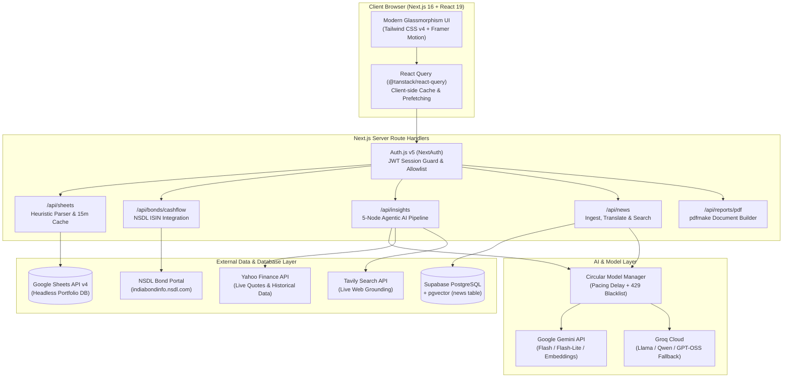

# 📈 Portfolio Tracker & Financial Intelligence Dashboard

> A comprehensive, modern, multi-asset financial dashboard built with **Next.js 16**, **React 19**, and **Tailwind CSS v4**. Tracks equities and bonds directly from your personal Google Sheets, integrates live bond coupon schedules from NSDL, provides a 5-node agentic AI portfolio analyst, and runs an automated multilingual financial news engine powered by **Supabase pgvector** and **Google Gemini**.

[](https://nextjs.org/)
[](https://react.dev/)
[](https://www.typescriptlang.org/)
[](https://tailwindcss.com/)
[](https://supabase.com/)
[](https://ai.google.dev/)
[](https://www.docker.com/)

---

> [!IMPORTANT]
> ### 🤖 Disclaimer: 100% Vibe Coded / AI-Assisted Project
> **This project was completely built using "vibe coding" and AI-assisted development.**
>
> The author possesses foundational full-stack web development knowledge and directed AI agents (such as Google Gemini and Anthropic Claude) to architect, scaffold, implement, and refine the application. The author may not have deep, line-by-line theoretical knowledge of every complex pattern utilized in this codebase (including low-level vector similarity search SQL functions, agentic LLM fallback queues, and AST parsing).
>
> As a consequence:
> - The codebase, architecture, dependency choices, API integrations, and security practices may contain undiscovered bugs, inefficiencies, suboptimal patterns, or security gaps.
> - **Do not use this codebase in high-stakes production or mission-critical financial environments without conducting an independent code audit, rigorous testing, and validation by experienced software engineers and cybersecurity professionals.**
> - This project serves primarily as an exploration of how modern AI coding workflows can bridge domain intent and full-stack software delivery.

---

## 🚀 Live Demo & Reference Data

- **Live Application:** [portfolio-tracker-kishoreabcs-projects.vercel.app](https://portfolio-tracker-kishoreabcs-projects.vercel.app/)
  - *Demo Credentials:* Username: `test` | Password: `test`
- **Google Sheets Data Template:** [View Reference Google Sheet](https://docs.google.com/spreadsheets/d/1uDp-iC8BJYWLzDHcuPv1Go40Pikkt24OBH58G4ewYOU/edit?usp=sharing)
  - Make a copy of this sheet to format your personal portfolio for seamless integration.

---

## 📖 Overview & Core Purpose

Traditional portfolio management software often comes with significant downsides: it stores sensitive financial records in proprietary third-party databases, locks users into rigid data schemas, lacks native support for Indian fixed-income bonds/debentures, and provides generic market news detached from an individual's actual holdings.

**Portfolio Tracker Dashboard** was engineered to solve these problems by:
1. **Ensuring Data Privacy & Control:** Using a personal Google Sheet as a headless database. You own and control your data; the dashboard operates on read-only API access.
2. **Supporting Multi-Asset Classes:** Native tracking for both Equities (stocks) and Fixed Income (Bonds, NCDs, SGBs) with credit ratings, face value, yield-to-maturity (YTM), and automated coupon schedules.
3. **Automating Fixed-Income Due Diligence:** Fetching official coupon payment dates and cashflow schedules for Indian bonds using direct ISIN lookup against the NSDL Bond Information database.
4. **Delivering Contextual AI Intelligence:** Running a 5-node agentic AI pipeline that analyzes your portfolio's health, checks diversification, cross-references macroeconomic market trends via live web grounding, and conducts stress-testing simulations.
5. **Connecting Breaking News to Your Holdings:** Scraping regional RSS financial feeds, translating non-English news (e.g., Tamil financial articles) into English via LLMs, creating vector embeddings, and automatically tagging articles that mention companies currently in your portfolio.

---

## 🌟 Key Features

### 1. Unified Multi-Asset Dashboard
- **Executive Overview:** Real-time net worth calculation, total equity value, total bond value, day's P&L, and cashflow allocations.
- **Top Movers & Performance:** Automatic computation of daily top gainers and losers.
- **Asset & Sector Breakdown:** Interactive Recharts charts detailing sector concentration and asset class distributions.

### 2. Intelligent Google Sheets Engine (Heuristic Parsing)
- **Zero-Rigidity Column Matching:** Flexible synonym-based header detection (`lib/sheets/parser.ts`). Recognizes varied column headers such as `cmp`, `ltp`, `current price`, `qty`, `shares`, `units`, `isin`, `coupon`, etc.
- **In-Memory Caching:** 15-minute server-side caching with instant cache invalidation via `/api/portfolio?force=true`.

### 3. Fixed-Income & Bond Management
- **Bond Portfolio Analytics:** Track total bond holdings, weighted coupon rates, yield to maturity (YTM), duration, and credit rating distributions (AAA down to NR).
- **NSDL API Cashflow Sync:** Direct HTTPS integration with the National Securities Depository Limited (`indiabondinfo.nsdl.com`) to extract verified historical and upcoming coupon payout dates for 12-character ISINs.
- **Maturity Calendar & Cashflow Forecasting:** Monthly visual timeline of upcoming interest payouts and principal redemptions.

### 4. 5-Node Agentic AI Insights Pipeline
A sequential multi-agent pipeline (`lib/ai/pipeline.ts`) that orchestrates specialized AI analysis tailored specifically for Indian retail investors:
- **Node 1 — Portfolio Analyzer:** Computes quantitative portfolio metrics, Herfindahl-Hirschman Index (HHI), and diversification scores, while scanning real-time fundamental multiples (Trailing P/E, Forward P/E, P/B) and technical momentum indicators (50DMA, 200DMA, distance from 52W High/Low, technical breadth % above 200DMA) via Yahoo Finance for top equity holdings.
- **Node 2 — Macro Analyst:** Grounds analysis with live web search via dual-query Tavily Advanced Search, fallback Google News RSS queries, ingested database news feeds, and real-time Yahoo Finance benchmark indices & macro commodities: Nifty 50 (`^NSEI`), Sensex (`^BSESN`), USD/INR (`USDINR=X`), Brent Crude Oil (`BZ=F`), Gold (`GC=F`), and US 10Y Yield (`^TNX`). Evaluates RBI MPC repo rate trajectory, Brent crude CAD impact on fiscal math, and FII vs DII flow dynamics.
- **Node 3 — Strategy Node:** Delivers a SEBI-grade Indian Retail Investor Playbook with stock-level fundamental and technical actions (accumulating near 200DMA support vs trimming overvalued holdings), core compounding instruments (Nifty 50 and Nifty Next 50 index funds, Target Maturity Debt Funds, Sovereign Gold Bonds / Gold ETFs, Arbitrage funds for equity tax treatment), Union Budget LTCG (12.5% above ₹1.25L exemption threshold) & STCG (20%) tax harvesting, and CDSL/NSDL Depository Participant (DP) charge minimization.
- **Node 4 — Risk Engine:** Performs portfolio stress-scenario simulations and constructs a macro-grounded Market Outlook featuring explicit investment horizon (e.g., 6–12 months), tactical short-term (1–3M) and structural medium-term (6–12M) outlooks, and Bull/Base/Bear scenarios with explicit macroeconomic triggers and portfolio impact estimates.
- **Node 5 — Report Generator:** Synthesizes analysis into a clean, structured JSON response consumed by the dashboard UI.
- **Circular Model Failover:** Automatically switches across configured models (`gemini-3.1-flash-lite`, `gemini-3.5-flash-lite`, Groq `llama-3.1`, `qwen3.6`, `gpt-oss-120b`) with inter-call pacing delays and auto-cooldown blacklisting when encountering 429 quota limits or 503 upstream congestion.

### 5. AI-Powered Financial News Hub & Vector Search
- **Automated RSS Ingestion:** Scrapes financial RSS feeds and strips HTML artifacts.
- **Regional Language Translation:** Translates non-English financial news into English via strict financial-preserving prompts (preserving INR values, company names, percentages, and fiscal dates).
- **Automated Portfolio Tagging:** Extracts mentioned Indian companies and matches them against active portfolio holdings using alias mapping.
- **Supabase pgvector Search:** Generates 3072-dimensional embeddings via Google Gemini embeddings, stored in a PostgreSQL database with an optimized cosine distance function (`match_news` RPC) for semantic natural-language searches.

### 6. Stock Watchlist & Explorer
- Search, filter, and sort stocks by sector, valuation, and percentage change.
- Interactive modal with historical price charts powered by Lightweight Charts and real-time quotes from Yahoo Finance.

### 7. PDF & CSV Reporting
- Export full portfolio summaries, equity holdings, bond schedules, and AI insight reports to structured CSV or styled PDF documents via `pdfmake`.

### 8. Enterprise-Style Authentication
- **Dual Authentication Modes:** NextAuth v5 supporting Google OAuth and local Credentials.
- **Access Control:** Restricts access using an email allowlist (`ALLOWED_EMAILS`).
- **Concurrent Session Protection:** Enforces single active user sessions, invalidating stale JWT sessions upon new login.

### 9. Groww-Style Privacy Mode (Hide Investment Details)
- **Omnipresent Eye Toggle:** Dedicated `Eye` / `EyeOff` button in the global Topbar (accessible on every page) and directly within the Net Worth KPI card header.
- **Masking Sensitive Balances:** When enabled, instantly masks net worth, equity totals, bond values, day's change, cash flow totals, upcoming bond coupon payments, and individual holding values/CMP with sleek bullets (`••••••`), matching Groww, Zerodha, and INDmoney.
- **Persistent State:** Synchronizes across browser tabs and preserves user preference in `localStorage` via React 19's `useSyncExternalStore`.
- **Chart Privacy:** Masks currency tooltips and axis labels in Recharts charts while keeping percentage allocations visible for contextual portfolio review.
- **AI Insights Commentary Privacy:** Automatically parses and masks AI-generated insights, opportunities, risk assessments, and recommendations to prevent portfolio balances (e.g., net worth, portfolio values, specific holding counts) from leaking into commentary while preserving strategic advice, percentages, and market metrics.

---

## 🏗️ Architecture & Data Flow


```mermaid
flowchart TD
    subgraph Client["Client Browser (Next.js 16 + React 19)"]
        UI["Modern Glassmorphism UI\n(Tailwind CSS v4 + Framer Motion)"]
        RQ["React Query (@tanstack/react-query)\nClient-side Cache & Prefetching"]
    end

    subgraph API["Next.js Server Route Handlers"]
        Auth["Auth.js v5 (NextAuth)\nJWT Session Guard & Allowlist"]
        SheetsRoute["/api/sheets\nHeuristic Parser & 15m Cache"]
        BondsRoute["/api/bonds/cashflow\nNSDL ISIN Integration"]
        InsightsRoute["/api/insights\n5-Node Agentic AI Pipeline"]
        NewsRoute["/api/news\nIngest, Translate & Search"]
        ReportsRoute["/api/reports/pdf\npdfmake Document Builder"]
    end

    subgraph DataSources["External Data & Database Layer"]
        GSheets[("Google Sheets API v4\n(Headless Portfolio DB)")]
        NSDL["NSDL Bond Portal\n(indiabondinfo.nsdl.com)"]
        Yahoo["Yahoo Finance API\n(Live Quotes & Historical Data)"]
        Tavily["Tavily Search API\n(Live Web Grounding)"]
        Supabase[("Supabase PostgreSQL\n+ pgvector (news table)")]
    end

    subgraph LLMLayer["AI & Model Layer"]
        ModelMgr["Circular Model Manager\n(Pacing Delay + 429 Blacklist)"]
        Gemini["Google Gemini API\n(Flash / Flash-Lite / Embeddings)"]
        Groq["Groq Cloud\n(Llama / Qwen / GPT-OSS Fallback)"]
    end

    UI --> RQ
    RQ --> Auth
    Auth --> SheetsRoute
    Auth --> BondsRoute
    Auth --> InsightsRoute
    Auth --> NewsRoute
    Auth --> ReportsRoute

    SheetsRoute --> GSheets
    BondsRoute --> NSDL
    InsightsRoute --> ModelMgr
    InsightsRoute --> Yahoo
    InsightsRoute --> Tavily
    NewsRoute --> Supabase
    NewsRoute --> ModelMgr

    ModelMgr --> Gemini
    ModelMgr --> Groq
```

---

## 💻 Tech Stack

| Category | Technologies / Libraries | Purpose |
| :--- | :--- | :--- |
| **Framework** | **Next.js 16.2.10** (App Router), **React 19.2.4** | Server components, client rendering, streaming, and API route handlers. |
| **Language** | **TypeScript 5** | End-to-end type safety across portfolio models, sheets, and AI agents. |
| **Styling & Animation** | **Tailwind CSS v4**, Framer Motion, Lucide React, Radix UI | Modern responsive dark UI, micro-animations, accessible primitives. |
| **State Management** | **TanStack React Query v5** | Server-state caching, automatic revalidation, and optimistic loading states. |
| **Primary Data Source** | **Google Sheets API v4** | Read-only access to user-owned portfolio spreadsheets. |
| **Database & Vector Store** | **Supabase** (PostgreSQL + `pgvector` extension) | Storage of financial news articles with 3072-dimensional vector similarity search. |
| **AI Framework** | **LangChain** (`@langchain/google-genai`, `@langchain/groq`, `@langchain/core`) | Agent abstractions, structured prompts, output parsing, and model switching. |
| **LLM Providers** | **Google Gemini** (Gemini 3.1 Flash Lite, 2.5 Flash, 3.7 Flash) & **Groq** | News translation, summarization, and multi-node portfolio analysis. |
| **Market & Bond APIs** | `yahoo-finance2`, NSDL BDS API | Real-time equity market quotes and official bond coupon schedule queries. |
| **Charts & Visualizations** | Recharts, Lightweight Charts (`lightweight-charts`) | Financial asset allocation charts, yield curves, and interactive candlesticks. |
| **Authentication** | **Auth.js** (NextAuth v5 beta) | Google OAuth 2.0 and Credentials authentication with session concurrency control. |
| **Document Export** | `pdfmake` | Server-rendered high-resolution PDF financial reports. |
| **DevOps & Container** | Docker (Alpine 3-stage build), Docker Compose | Production-ready containerization. |

---

## 📂 Project Structure

```text
Portfolio Tracker/
└── dashboard/
    ├── .dockerignore
    ├── Dockerfile                      # Multi-stage container build (deps -> builder -> runner)
    ├── docker-compose.yml              # Single-command Docker container orchestration
    ├── env_example.txt                 # Master environment variable template
    ├── package.json                    # Project metadata and dependencies
    ├── tsconfig.json                   # TypeScript compiler configuration
    ├── next.config.ts                  # Next.js runtime configuration
    ├── auth.ts                         # NextAuth v5 configuration & session handlers
    ├── middleware.ts                   # Route protection middleware
    │
    ├── app/                            # Next.js App Router
    │   ├── page.tsx                    # Executive Portfolio Dashboard (Home)
    │   ├── layout.tsx                  # Root layout, fonts, and global metadata
    │   ├── globals.css                 # Tailwind CSS v4 directives & theme tokens
    │   ├── providers.tsx               # QueryClientProvider & SessionProvider wrapper
    │   ├── login/                      # Authentication screen (Google OAuth & Credentials)
    │   ├── portfolio/                  # Unified equity & bond holdings table
    │   ├── stocks/                     # Stock watchlist, sector sorting & search
    │   ├── bonds/                      # Bond yield-to-maturity, credit ratings & cashflow
    │   ├── calendar/                   # Monthly coupon payment & bond maturity schedule
    │   ├── cashflow/                   # Income, expense & monthly savings analytics
    │   ├── analytics/                  # Diversification scores & sector allocations
    │   ├── insights/                   # 5-Node Agentic AI Insights execution dashboard
    │   ├── news/                       # AI Financial News Hub with pgvector semantic search
    │   ├── reports/                    # CSV and PDF export generator
    │   └── api/                        # Internal Serverless Route Handlers
    │       ├── auth/[...nextauth]/     # NextAuth OAuth callback handler
    │       ├── sheets/                 # Google Sheets discovery, fetcher & parser
    │       ├── bonds/cashflow/         # NSDL bond API proxy
    │       ├── insights/               # Multi-agent LLM pipeline trigger
    │       ├── news/                   # News listing & filtering
    │       │   ├── sync/               # Manual & Cron RSS sync worker
    │       │   ├── search/             # Cosine similarity vector search
    │       │   └── portfolio/          # Portfolio-filtered news stream
    │       ├── market-data/            # Live index quotes (NIFTY 50, SENSEX)
    │       ├── stocks/[symbol]/        # Yahoo Finance quote, profile & history
    │       └── reports/pdf/            # pdfmake PDF compilation route
    │
    ├── components/                     # Modular UI Components
    │   ├── layout/                     # Sidebar, Topbar, Navigation items
    │   ├── shared/                     # KpiCard, EmptyState, SectionHeader
    │   ├── ui/                         # Accessible UI primitives (Button, Card, Dialog, Table)
    │   ├── charts/                     # Recharts wrappers (Allocation, Performance)
    │   ├── bonds/                      # BondCashflowDialog, MaturityTimeline
    │   ├── insights/                   # AgentExecutionPanel, HealthCard, StrategyCard
    │   └── news/                       # NewsCard, SearchBar, SentimentBadge
    │
    ├── hooks/                          # Custom React Query Hooks
    │   ├── usePortfolioData.ts         # Central data hook for portfolio and sheets
    │   ├── useAiInsights.ts            # Hook managing agentic execution state
    │   └── useNews.ts                  # Hook for news feed, search, and pagination
    │
    ├── lib/                            # Business Logic & Infrastructure Layer
    │   ├── ai/                         # Agent pipeline nodes, circular model manager & Tavily
    │   ├── sheets/                     # Google Sheets client, tab discovery, heuristic parser
    │   ├── bonds/                      # NSDL HTTPS client
    │   ├── calc/                       # Math for HHI index, risk, diversification, forecasts
    │   ├── news/                       # RSS fetcher, translation, embeddings, company extraction
    │   ├── mappers/                    # Normalizers converting raw Sheet cells to typed models
    │   ├── supabase.ts                 # Supabase client singleton
    │   └── utils.ts                    # ClassName helper (clsx + twMerge)
    │
    ├── types/                          # TypeScript Interfaces & Types
    │   ├── holdings.ts                 # Equity holding types
    │   ├── bonds.ts                    # Bond holding & NSDL response types
    │   ├── sheets.ts                   # Raw and parsed sheet cell representations
    │   ├── insights.ts                 # Structured AI Insights output schema
    │   ├── news.ts                     # News article, company tag, and search query types
    │   └── agent-activity.ts           # Agent pipeline event stream types
    │
    └── supabase/                       # Supabase Database Schemas
        └── migrations/
            ├── 001_create_news.sql     # News table schema with vector extension
            ├── 002_create_news_vector_search.sql # match_news cosine similarity function
            └── 003_news_cron_sync.sql  # Scheduled sync triggers
```

---

## ⚙️ Prerequisites

Before getting started, make sure you have:
1. **Node.js**: Version `20.x` or higher (`v22+` recommended).
2. **Package Manager**: `npm` (v10+) or `pnpm`.
3. **Google Cloud Console Account**:
   - A Google Cloud Project with the **Google Sheets API v4** enabled.
   - A Google Sheets API Key.
   - (Optional for Google Sign-in) OAuth 2.0 Client ID & Client Secret.
4. **Supabase Project** (Required for the News module):
   - A free Supabase PostgreSQL database with the `pgvector` extension enabled.
5. **AI API Keys**:
   - **Google Gemini API Key** (from [Google AI Studio](https://aistudio.google.com/)).
   - *(Optional Fallback)* **Groq API Key** (from [Groq Console](https://console.groq.com/)).
   - *(Optional Grounding)* **Tavily API Key** (from [Tavily AI](https://tavily.com/)).

---

## 🛠️ Installation & Setup

### 1. Clone the Repository
```bash
git clone https://github.com/kishoreabc/Portfolio_Tracker.git
cd Portfolio_Tracker/dashboard
```

### 2. Install Dependencies
```bash
npm install
```

### 3. Configure Environment Variables
Copy the template configuration to create your local environment file:
```bash
cp env_example.txt .env.local
```
Open `.env.local` in your editor and provide the necessary API keys and configuration values (refer to the [Environment Variables Reference](#-environment-variables-reference) below).

Generate a secure NextAuth secret by running:
```bash
npx auth secret
```
Copy the generated secret and set it as `AUTH_SECRET` in `.env.local`.

### 4. Set Up Supabase Database (pgvector)
1. Open your Supabase project dashboard and navigate to the **SQL Editor**.
2. Run the migration scripts located in `supabase/migrations/` in order:
   - Run `001_create_news.sql`: Installs the `vector` extension and creates the `public.news` table.
   - Run `002_create_news_vector_search.sql`: Creates the `public.match_news` stored procedure for cosine similarity vector search.

### 5. Start the Development Server
```bash
npm run dev
```
Open [http://localhost:3000](http://localhost:3000) in your browser.

---

## 🔐 Environment Variables Reference

| Variable | Required | Default / Example | Description |
| :--- | :---: | :--- | :--- |
| `GOOGLE_SHEET_ID` | **Yes** | `1uDp-iC8BJYWLzDH...` | The unique ID of your Google Sheet (from its URL). |
| `GOOGLE_SHEETS_API_KEY` | **Yes** | `AIzaSy...` | Google Cloud API key with access to Google Sheets API v4. |
| `AUTH_SECRET` | **Yes** | `32-byte-hex-string` | Secret key used to encrypt NextAuth JWT session tokens. |
| `AUTH_URL` | **Yes** | `http://localhost:3000` | Canonical base URL of the deployment. |
| `LOGIN_USERNAME` | **Yes** | `test` | Username for Credentials-based login. |
| `LOGIN_PASSWORD` | **Yes** | `test` | Password for Credentials-based login. |
| `GOOGLE_CLIENT_ID` | No | `*.apps.googleusercontent.com` | Google OAuth client ID for Google sign-in. |
| `GOOGLE_CLIENT_SECRET`| No | `GOCSPX-...` | Google OAuth client secret. |
| `ALLOWED_EMAILS` | No | `user@example.com,admin@example.com` | Comma-separated list of emails permitted to authenticate via Google. |
| `GEMINI_API_KEY` | **Yes** | `AIzaSy...` | Primary Google Gemini API key for translation, summarization, and AI Insights. |
| `GEMINI_INSIGHTS_API_KEY` | No | `AIzaSy...` | Dedicated Gemini key for the agentic pipeline (falls back to `GEMINI_API_KEY`). |
| `GEMINI_EMBEDDING_API_KEY`| No | `AIzaSy...` | Dedicated Gemini key for embedding generation (falls back to `GEMINI_API_KEY`). |
| `GROQ_API_KEY` | No | `gsk_...` | Groq Cloud API key for high-speed fallback LLM calls. |
| `TAVILY_API_KEY` | No | `tvly-...` | Tavily search API key for live web grounding in the Macro Analyst node. |
| `GEMINI_MODEL` | No | `gemini-3.1-flash-lite, gemini-3.5-flash-lite` | Comma-separated list of Gemini model tiers to rotate through. |
| `FALLBACK_MODELS` | No | `openai/gpt-oss-120b, qwen/qwen3.6-27b` | Comma-separated list of Groq models to use upon Gemini quota exhaustion. |
| `SUPABASE_URL` | **Yes** | `https://xxxx.supabase.co` | Your Supabase project URL. |
| `SUPABASE_SERVICE_ROLE_KEY` | **Yes** | `eyJhbGciOi...` | Supabase service role secret (backend only; bypasses Row Level Security). |
| `RSS_URL` | **Yes** | `https://example.com/rss` | RSS feed URL providing financial news articles for ingestion. |
| `NEWS_SYNC_BATCH_SIZE` | No | `5` | Batch size for concurrent news translation and embedding. |
| `NEWS_SEARCH_TOP_K` | No | `20` | Maximum number of matched news articles returned from vector search. |

---

## 🐳 Docker Deployment

The application includes an optimized multi-stage `Dockerfile` (based on Node 22 Alpine) and a `docker-compose.yml` for local containerized development or production VPS hosting.

### Run with Docker Compose
```bash
docker compose up --build -d
```
The application will build, configure environment variables from `.env.local` or `.env`, and start listening on [http://localhost:3000](http://localhost:3000).

To view container logs:
```bash
docker compose logs -f
```

To stop the container:
```bash
docker compose down
```

---

## 🌐 API Endpoints Reference

| Route | Method | Description | Query / Body Parameters |
| :--- | :---: | :--- | :--- |
| `/api/portfolio` | `GET` | Authenticated: Fetches and returns sanitized, transformed portfolio data. | `?force=true` (bypasses in-memory 15-minute cache) |
| `/api/portfolio/summary` | `GET` | Authenticated: Returns high-level portfolio summary metrics. | `?force=true` |
| `/api/sheets` | `GET` | **Blocked / Disabled:** Direct access to raw Google Sheets data is rejected. | N/A |
| `/api/bonds/cashflow` | `GET` | Authenticated: Queries NSDL BDS service for coupon and redemption schedules. | `?isin=INE002A08018` |
| `/api/insights` | `GET, POST` | Authenticated: User-scoped 5-node agentic AI portfolio analysis pipeline. | Body: `{ equity, bonds, cashFlow, ... }` |
| `/api/news` | `GET` | Authenticated: Returns paginated news articles with company tags. | `?page=1&limit=20&portfolioOnly=true` |
| `/api/news/search` | `GET` | Authenticated: Vector semantic search or full-text search across news articles. | `?q=interest+rate&semantic=true` |
| `/api/news/sync` | `POST` | Authenticated: Triggers RSS ingestion and tagging pipeline. | Body: `{ portfolioCompanies?: string[] }` |
| `/api/news/sync/cron` | `GET` | Internal Cron: Scheduled background news sync with Bearer token. | Authorization: `Bearer <CRON_SECRET>` |
| `/api/news/[id]/reprocess` | `POST` | Authenticated: Re-translates, re-embeds, and re-tags a specific news record. | URL param: `id` |
| `/api/market-data` | `GET` | Public: Fetches live market indices for login screen and dashboard ticker. | None |
| `/api/stocks/[symbol]/quote` | `GET` | Authenticated: Real-time price quote from Yahoo Finance with sanitized response. | URL param: `symbol` (e.g., `TCS.NS`) |
| `/api/stocks/[symbol]/history`| `GET` | Authenticated: Historical price bars for candlestick charts. | `?range=1y&interval=1d` |
| `/api/stocks/[symbol]/profile`| `GET` | Authenticated: Sanitized company overview and fundamentals. | URL param: `symbol` |
| `/api/reports/pdf` | `POST` | Authenticated: Generates downloadable PDF dossier using `pdfmake`. | Body: `{ reportType: 'portfolio' \| 'ai', data }` |

---

## 📊 Available Scripts

In the `dashboard/` directory, you can run:

```bash
# Run local development server
npm run dev

# Run ESLint validation
npm run lint

# Build production bundle with Next.js App Router
npm run build

# Start the compiled production build
npm start
```

---

## ⚠️ Known Limitations & Troubleshooting

1. **Google Sheets API Rate Limits:**
   - The Google Sheets API v4 enforces a free tier quota of 300 requests per minute per project. The dashboard includes a 15-minute server-side in-memory cache to stay well below this limit during normal usage.
2. **LLM Quota (HTTP 429) & Model Cooldowns:**
   - Free-tier Google Gemini API keys may occasionally encounter strict RPM/TPM limits during news sync or when executing the full 5-agent AI pipeline.
   - The built-in `ModelManager` automatically blacklists saturated models for 60 seconds, gracefully shifts traffic to alternate Gemini tiers, and falls back to configured Groq models.
3. **ISIN Format Verification:**
   - The NSDL cashflow API endpoint expects a valid 12-character Indian ISIN (e.g., `INE...`). If an invalid ISIN is provided in your Google Sheet, the cashflow dialog will display an error for that specific holding without breaking the rest of the dashboard.
4. **Single Active Session Behavior:**
   - If you sign in on a new device or browser window using the same account credentials, any previous active sessions will be invalidated on their next API request.

---

## 📄 License

This project is open-source and maintained for personal portfolio tracking and educational purposes.
