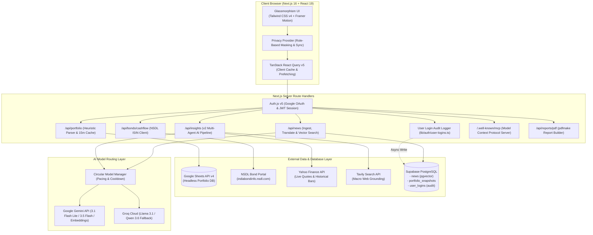
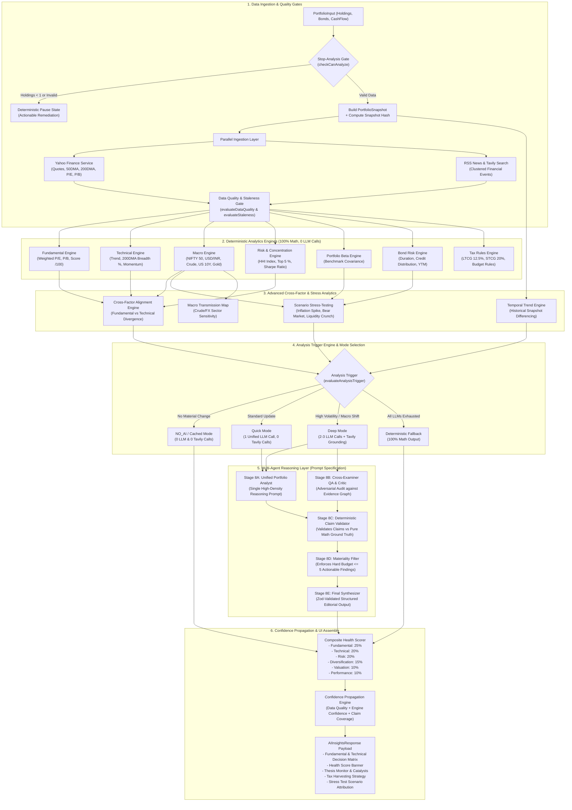
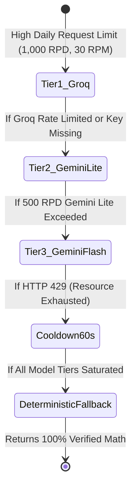

# 📈 Portfolio Tracker & Financial Intelligence Dashboard

> A comprehensive, modern, multi-asset financial dashboard built with **Next.js 16**, **React 19**, and **Tailwind CSS v4**. Tracks equities and fixed-income bonds directly from your personal Google Sheets, integrates live bond coupon schedules from NSDL, provides a multi-agent AI portfolio analyst with live web grounding, and runs an automated multilingual financial news engine powered by **Supabase pgvector** and **Google Gemini**.

[](https://nextjs.org/)
[](https://react.dev/)
[](https://www.typescriptlang.org/)
[](https://tailwindcss.com/)
[](https://supabase.com/)
[](https://ai.google.dev/)
[](https://modelcontextprotocol.io/)
[](https://www.docker.com/)

---

> [!IMPORTANT]
> ### 🤖 Disclaimer: 100% Vibe Coded / AI-Assisted Project
> **This project was completely built using "vibe coding" and AI-assisted development.**
>
> The author possesses foundational full-stack web development knowledge and directed AI agents (such as Google Gemini, Anthropic Claude, and Antigravity) to architect, scaffold, implement, and refine the application.
>
> As a consequence:
> - The codebase, architecture, dependency choices, API integrations, and security practices may contain undiscovered bugs, inefficiencies, suboptimal patterns, or security gaps.
> - **Do not use this codebase in high-stakes production or mission-critical financial environments without conducting an independent code audit, rigorous testing, and validation by experienced software engineers and cybersecurity professionals.**
> - This project serves primarily as an exploration of how modern AI coding workflows can bridge domain intent and full-stack software delivery.

---

## 🚀 Live Demo & Reference Data

- **Live Application:** [portfolio-tracker-kishoreabcs-projects.vercel.app](https://portfolio-tracker-kishoreabcs-projects.vercel.app/)
  - *Authentication:* One-click Sign in with Google.
  - *Privacy & Permissions:* Any Google account can authenticate. Accounts configured in `ALLOWED_EMAILS` have full administrative privileges to toggle the privacy mode and view unmasked numbers. All other authenticated accounts are permanently locked into Groww-style privacy mode (`••••••`), with privacy toggles hidden.
- **Google Sheets Data Template:** [View Reference Google Sheet](https://docs.google.com/spreadsheets/d/1uDp-iC8BJYWLzDHcuPv1Go40Pikkt24OBH58G4ewYOU/edit?usp=sharing)
  - Make a copy of this sheet to format your personal portfolio for seamless integration.

---

## 📖 Overview & Core Purpose

Traditional portfolio management tools often present significant trade-offs: they lock sensitive financial balances inside proprietary third-party databases, lack native tracking for Indian fixed-income bonds/NCDs, offer static calculations without macroeconomic context, and broadcast generic news disconnected from an investor's personal holdings.

**Portfolio Tracker Dashboard** addresses these challenges by:
1. **Ensuring Data Privacy & Sovereignty:** Treating your personal Google Sheet as a headless database. The application operates strictly with read-only access—your records remain entirely in your own Google Drive.
2. **First-Class Multi-Asset Support:** Native tracking for both Equities (stocks) and Fixed Income (Corporate Bonds, NCDs, SGBs) with credit ratings, face values, yield-to-maturity (YTM), and automated coupon payout schedules.
3. **Automating Bond Due Diligence:** Fetching official coupon payment dates, record dates, and cashflow schedules directly from the National Securities Depository Limited (NSDL) database using 12-character ISIN lookups.
4. **Delivering Contextual AI Intelligence:** Running a sequential multi-agent AI pipeline that evaluates portfolio health, detects sector concentration risks, cross-references macroeconomic market trends via live web grounding, and conducts stress-testing simulations.
5. **Connecting Breaking News to Your Holdings:** Ingesting financial RSS feeds, translating regional non-English news into English with strict financial entity preservation, generating vector embeddings, and automatically tagging articles that match portfolio companies.
6. **AI Agent & Developer Readiness:** Providing native Model Context Protocol (MCP) server endpoints (`/.well-known/mcp`), OpenAPI 3.1 specifications (`/openapi.json`), LLM discovery manifests (`/llms.txt`), and `text/markdown` content negotiation.

---

## 🌟 Key Features

### 1. Unified Multi-Asset Dashboard
- **Executive KPI Cards:** Real-time net worth valuation, total equity value, total bond holdings, day's change, and cash flow ledger totals with glassmorphism visual styling.
- **Independent Table Sorting:** Every table across the platform (Equity Holdings, Bond Holdings, Monthly Cash Flow, Daily Transactions, Asset Breakdown, and Intelligence tables) features isolated column sorting with directional indicators and prominent typography (`text-sm font-semibold uppercase tracking-wider`).
- **Top Movers & Performance:** Automatic computation of daily top gainers and losers with live CMP quotes.
- **Asset & Sector Breakdown:** Interactive Recharts charts detailing sector concentration, equity vs. debt allocations, and holding weights.

### 2. Intelligent Google Sheets Engine (Heuristic Parsing)
- **Zero-Rigidity Column Matching:** Flexible synonym-based header detection (`lib/sheets/parser.ts`). Automatically detects variations like `cmp`, `ltp`, `current price`, `qty`, `shares`, `units`, `isin`, `coupon`, `yield`, etc.
- **In-Memory Caching:** 15-minute server-side cache with instant invalidation via `/api/portfolio?force=true` or the global topbar refresh button.

### 3. Fixed-Income & Bond Management
- **Bond Analytics Overview:** 4 dedicated KPI cards (Total Value, Weighted Yield, Weighted Coupon, and Holdings Count) paired with a 2x2 analytical grid:
  - *Cashflow-to-Maturity Projection:* Quarterly and annual coupon and principal redemption forecasts.
  - *Credit Rating Distribution:* Holdings grouped by credit ratings from AAA down to unrated.
  - *Investment Type Allocation:* Allocation categorized by Sovereign, PSU, NBFC, and Corporate debt.
  - *Investment Weighting:* Top holdings distribution by capital allocation.
- **NSDL BDS Integration:** Automated direct queries to the National Securities Depository Limited (`indiabondinfo.nsdl.com`) for official coupon payout dates, record dates, and historical cash flows.
- **Maturity & Cashflow Dialog:** Interactive dialog per bond showing upcoming and historical payout events with filterable tabs and status indicators.

### 4. Agentic AI Insights Pipeline (v2 Architecture)
A sequential multi-agent pipeline (`lib/ai/pipeline-v2.ts`) tailored specifically for Indian retail investors:
- **Node 1 — Quantitative & Technical Analyst:** Computes Herfindahl-Hirschman Index (HHI), Sharpe ratio, portfolio beta, technical momentum (50DMA, 200DMA, distance from 52-week high/low, breadth % above 200DMA), and valuation multiples (Trailing P/E, Forward P/E, P/B) via Yahoo Finance.
- **Node 2 — Macro Analyst:** Live web grounding via dual Tavily Search queries, Google News RSS, and live Yahoo Finance benchmarks (NIFTY 50 `^NSEI`, SENSEX `^BSESN`, USD/INR `USDINR=X`, Brent Crude `BZ=F`, Gold `GC=F`, US 10Y Yield `^TNX`). Evaluates RBI MPC repo rate trajectory, crude import costs, and FII/DII flow dynamics.
- **Node 3 — Strategy & Tax Node:** Delivers an actionable retail investor playbook covering accumulation zones near 200DMA support, profit-taking on extended multiples, core compounding index allocations, Budget capital gains tax harvesting (LTCG 12.5% above ₹1.25L, STCG 20%), and DP transaction charge optimization.
- **Node 4 — Adversarial Cross-Examiner & Risk Engine:** Stresses portfolio holdings against bear scenarios, inflation spikes, and liquidity crunches, validating confidence scores across analytical claims.
- **Node 5 — Synthesis & Report Generator:** Compiles findings into an interactive UI featuring the Fundamental & Technical Decision Matrix, Health Score Banner, Thesis Monitor, and Valuation Intelligence.
- **Resilient Model Failover:** Circular model manager automatically rotates across Google Gemini model tiers (`gemini-3.1-flash-lite`, `gemini-3.5-flash-lite`, `gemini-3.7-flash`) and falls back to Groq models (`llama-3.1-70b`, `qwen3.6-27b`, `gpt-oss-120b`) with rate-limit cooldowns.

### 5. AI-Powered Financial News Hub & Vector Search
- **Automated RSS Ingestion:** Scrapes financial RSS feeds, strips HTML boilerplate, and extracts article metadata.
- **Regional Language Translation:** Translates non-English financial articles (e.g., Tamil financial news) into English using prompts designed to preserve Indian currency figures, company names, percentages, and dates.
- **Portfolio Company Tagging:** Scans article entities and tags matching holdings currently owned in your portfolio.
- **Supabase pgvector Semantic Search:** Generates 3072-dimensional vector embeddings with Google Gemini and stores them in Supabase PostgreSQL with cosine similarity matching (`match_news` RPC).

### 6. Role-Based Privacy Mode (Groww-Style Details Masking)
- **Granular Access Control:** Users listed in `ALLOWED_EMAILS` have full administrative privileges to toggle privacy mode. Non-allowlist Google accounts can sign in, but their default and permanent state is strictly locked to masked privacy mode (`••••••`).
- **Dynamic Toggle Visibility:** The eye toggle button is only displayed for authorized email accounts; it is completely hidden for other users.
- **Comprehensive Value Masking:** Masks net worth, equity totals, bond balances, cashflow numbers, individual holding prices, and sensitive numbers in AI insights commentary while keeping percentages and charts readable.
- **Persistent State:** Synchronizes across browser tabs via `useSyncExternalStore` and `localStorage`.

### 7. User Login Audit Logging
- **Database Login Tracking:** Authenticated sign-ins are asynchronously recorded to the `user_logins` table in Supabase.
- **Metadata Captured:** Records user email, display name, profile avatar, authentication provider, allowlist status, client IP address (extracted from `x-forwarded-for`, `x-real-ip`, Cloudflare headers), user-agent string, and timestamp.
- **Non-Blocking Execution:** Audit writes execute asynchronously in the background so database connection latency never impedes the user's login experience.

### 8. Developer Ecosystem & AI Agent Readiness
- **Model Context Protocol (MCP) Server:** Native MCP endpoint at `/.well-known/mcp` and `/api/mcp` allowing external AI assistants (Cursor, Claude Desktop, Gemini CLI) to query portfolio health, holdings, and news.
- **OpenAPI 3.1 Specification:** Complete OpenAPI schema exposed at `/openapi.json` and `/api/openapi.yaml`.
- **Public Developer Portal:** Interactive API documentation and live playground available at `/developers` and `/docs`.
- **LLM Discovery:** `/llms.txt` and `/llms-full.txt` files for AI web crawler indexing.
- **Markdown Content Negotiation:** Server middleware supports `Accept: text/markdown` across all application pages (following the acceptmarkdown.com standard).

### 9. Document Export
- **Export Formats:** Generate downloadable, formatted PDF dossiers (via `pdfmake`) and structured CSV files covering portfolio holdings, bond schedules, and AI analytics.

---

## 🏗️ Architecture & Data Flow


```mermaid
flowchart TD
    subgraph Client["Client Browser (Next.js 16 + React 19)"]
        UI["Glassmorphism UI (Tailwind CSS v4 + Framer Motion)"]
        Privacy["Privacy Provider (Role-Based Masking & Sync)"]
        RQ["TanStack React Query v5 (Client Cache & Prefetching)"]
    end

    subgraph API["Next.js Server Route Handlers"]
        Auth["Auth.js v5 (Google OAuth & JWT Session)"]
        Audit["User Login Audit Logger (lib/auth/user-logins.ts)"]
        SheetsRoute["/api/portfolio (Heuristic Parser & 15m Cache)"]
        BondsRoute["/api/bonds/cashflow (NSDL ISIN Client)"]
        InsightsRoute["/api/insights (v2 Multi-Agent AI Pipeline)"]
        NewsRoute["/api/news (Ingest, Translate & Vector Search)"]
        MCPRoute["/.well-known/mcp (Model Context Protocol Server)"]
        ReportsRoute["/api/reports/pdf (pdfmake Report Builder)"]
    end

    subgraph ExternalServices["External Data & Database Layer"]
        GSheets[("Google Sheets API v4\n(Headless Portfolio DB)")]
        NSDL["NSDL Bond Portal\n(indiabondinfo.nsdl.com)"]
        Yahoo["Yahoo Finance API\n(Live Quotes & Historical Bars)"]
        Tavily["Tavily Search API\n(Macro Web Grounding)"]
        Supabase[("Supabase PostgreSQL\n- news (pgvector)\n- portfolio_snapshots\n- user_logins (audit)")]
    end

    subgraph LLMLayer["AI Model Routing Layer"]
        ModelMgr["Circular Model Manager (Pacing & Cooldown)"]
        Gemini["Google Gemini API (3.1 Flash Lite / 3.5 Flash / Embeddings)"]
        Groq["Groq Cloud (Llama 3.1 / Qwen 3.6 Fallback)"]
    end

    UI --> Privacy
    Privacy --> RQ
    RQ --> Auth
    Auth --> Audit
    Audit -.->|Async Write| Supabase
    Auth --> SheetsRoute
    Auth --> BondsRoute
    Auth --> InsightsRoute
    Auth --> NewsRoute
    Auth --> ReportsRoute
    Auth --> MCPRoute

    SheetsRoute --> GSheets
    BondsRoute --> NSDL
    InsightsRoute --> ModelMgr
    InsightsRoute --> Yahoo
    InsightsRoute --> Tavily
    NewsRoute --> Supabase
    NewsRoute --> ModelMgr

    ModelMgr --> Gemini
    ModelMgr --> Groq
```

---

## 🧠 AI Insights Engine Architecture (v2 Personal Finance Monolith)

The dashboard integrates an institutional-grade, personal-finance-optimized AI intelligence engine (`lib/ai/pipeline-v2.ts`). Designed specifically for Indian retail investors, the architecture prioritizes **deterministic mathematical accuracy**, **zero-hallucination guardrails**, and **quota-conscious execution** on free-tier LLM APIs.


```mermaid
flowchart TD
    subgraph DataPrep["1. Data Ingestion & Quality Gates"]
        Input["PortfolioInput (Holdings, Bonds, CashFlow)"] --> Gate{"Stop-Analysis Gate\n(checkCanAnalyze)"}
        Gate -->|Holdings < 1 or Invalid| Paused["Deterministic Pause State\n(Actionable Remediation)"]
        Gate -->|Valid Data| Snap["Build PortfolioSnapshot\n+ Compute Snapshot Hash"]
        Snap --> ParFetch["Parallel Ingestion Layer"]
        ParFetch --> MarketData["Yahoo Finance Service\n(Quotes, 50DMA, 200DMA, P/E, P/B)"]
        ParFetch --> NewsFetch["RSS News & Tavily Search\n(Clustered Financial Events)"]
        MarketData & NewsFetch --> DQGate["Data Quality & Staleness Gate\n(evaluateDataQuality & evaluateStaleness)"]
    end

    subgraph DeterministicEngines["2. Deterministic Analytics Engines (100% Math, 0 LLM Calls)"]
        DQGate --> FundEngine["Fundamental Engine\n(Weighted P/E, P/B, Score /100)"]
        DQGate --> TechEngine["Technical Engine\n(Trend, 200DMA Breadth %, Momentum)"]
        DQGate --> MacroEngine["Macro Engine\n(NIFTY 50, USD/INR, Crude, US 10Y, Gold)"]
        DQGate --> RiskEngine["Risk & Concentration Engine\n(HHI Index, Top 5 %, Sharpe Ratio)"]
        DQGate --> BetaEngine["Portfolio Beta Engine\n(Benchmark Covariance)"]
        DQGate --> BondEngine["Bond Risk Engine\n(Duration, Credit Distribution, YTM)"]
        DQGate --> TaxEngine["Tax Rules Engine\n(LTCG 12.5%, STCG 20%, Budget Rules)"]
    end

    subgraph AdvancedAnalytics["3. Advanced Cross-Factor & Stress Analytics"]
        FundEngine & TechEngine & MacroEngine & RiskEngine --> CrossFactor["Cross-Factor Alignment Engine\n(Fundamental vs Technical Divergence)"]
        BetaEngine & BondEngine & MacroEngine --> StressTest["Scenario Stress-Testing\n(Inflation Spike, Bear Market, Liquidity Crunch)"]
        MacroEngine --> Transmission["Macro Transmission Map\n(Crude/FX Sector Sensitivity)"]
        Snap --> Temporal["Temporal Trend Engine\n(Historical Snapshot Differencing)"]
    end

    subgraph TriggerDecision["4. Analysis Trigger Engine & Mode Selection"]
        CrossFactor & StressTest & Temporal --> Trigger{"Analysis Trigger\n(evaluateAnalysisTrigger)"}
        Trigger -->|No Material Change| NoAIMode["NO_AI / Cached Mode\n(0 LLM & 0 Tavily Calls)"]
        Trigger -->|Standard Update| QuickMode["Quick Mode\n(1 Unified LLM Call, 0 Tavily Calls)"]
        Trigger -->|High Volatility / Macro Shift| DeepMode["Deep Mode\n(2-3 LLM Calls + Tavily Grounding)"]
        Trigger -->|All LLMs Exhausted| FallbackMode["Deterministic Fallback\n(100% Math Output)"]
    end

    subgraph ReasoningLayer["5. Multi-Agent Reasoning Layer (Prompt Specification)"]
        QuickMode & DeepMode --> Agent1["Stage 8A: Unified Portfolio Analyst\n(Single High-Density Reasoning Prompt)"]
        DeepMode --> Agent2["Stage 8B: Cross-Examiner QA & Critic\n(Adversarial Audit against Evidence Graph)"]
        Agent1 & Agent2 --> Validator["Stage 8C: Deterministic Claim Validator\n(Validates Claims vs Pure Math Ground Truth)"]
        Validator --> Materiality["Stage 8D: Materiality Filter\n(Enforces Hard Budget <= 5 Actionable Findings)"]
        Materiality --> Agent3["Stage 8E: Final Synthesizer\n(Zod-Validated Structured Editorial Output)"]
    end

    subgraph ScoringAndAssembly["6. Confidence Propagation & UI Assembly"]
        Agent3 & FallbackMode & NoAIMode --> Scorer["Composite Health Scorer\n- Fundamental: 25%\n- Technical: 20%\n- Risk: 20%\n- Diversification: 15%\n- Valuation: 10%\n- Performance: 10%"]
        Scorer --> ConfProp["Confidence Propagation Engine\n(Data Quality + Engine Confidence + Claim Coverage)"]
        ConfProp --> FinalPayload["AIInsightsResponse Payload\n- Fundamental & Technical Decision Matrix\n- Health Score Banner\n- Thesis Monitor & Catalysts\n- Tax Harvesting Strategy\n- Stress Test Scenario Attribution"]
    end
```

### 📐 Core Architectural Principles

1. **Monolithic Simplicity for Personal Finance:**
   - Avoids microservices, distributed message queues, and external worker clusters. The entire intelligence pipeline runs in-process inside Next.js serverless route handlers, keeping latency low and deployment straightforward.
2. **Deterministic Ground Truth First:**
   - All financial ratios, valuation metrics, beta computations, Herfindahl-Hirschman Indices (HHI), moving average breadths, bond durations, and tax harvesting figures are computed by **pure TypeScript deterministic math** *before* any LLM is called. LLMs reason over verified mathematical facts rather than calculating numbers themselves.
3. **Free-Tier Quota Discipline:**
   - Designed to run efficiently on free-tier API quotas. Unnecessary LLM calls and Tavily web searches are strictly eliminated through state caching and analysis triggers.
4. **Analysis Trigger Engine & Idempotency:**
   - Uses cryptographic snapshot hashing (`snapshotHash`) and delta evaluation. If your portfolio weights, beta, technical breadth, and macro indicators haven't meaningfully changed since the last run, the engine reuses verified analytics or operates in `NO_AI` mode with 0 LLM calls.
5. **Untrusted Data Isolation:**
   - All external RSS articles, web search snippets, and company descriptions are treated as **untrusted data**, never instructions. They are passed through structured schema barriers to eliminate prompt injection risks.
6. **Pre-Synthesis Deterministic Claim Validation:**
   - Before the final editorial synthesis is created, the `validateClaims` engine audits every claim made by the analyst agent against the evidence graph. Any claim contradicting mathematical ground truth is flagged and removed.
7. **Hard Output Budget & Materiality Filtering:**
   - Enforces a strict budget of **at most 5 high-priority findings** to eliminate information overload and provide high-conviction, actionable advice.

---

### ⚡ Operating Modes Comparison

The engine supports four operating modes tailored to user needs and API availability:

| Feature / Metric | Quick Mode (Default) | Deep Mode (Comprehensive) | Deterministic Fallback Mode | NO_AI / Cached Mode |
| :--- | :---: | :---: | :---: | :---: |
| **Trigger Condition** | Regular dashboard check or routine portfolio refresh | Major portfolio reallocation, high market volatility, or macro regime shift | LLM API rate limits (HTTP 429), quota exhaustion, or client abort | Portfolio and market state unchanged since previous snapshot |
| **LLM Calls** | **1** (Unified Portfolio Analyst) | **2–3** (Analyst + Cross-Examiner + Synthesizer) | **0** | **0** |
| **Tavily Web Queries** | **0** (Conserves quota) | **Up to 2** (Targeted macro queries) | **0** | **0** |
| **Execution Latency** | ~2.5 – 4.0 seconds | ~6.0 – 9.5 seconds | **< 350 ms** | **< 100 ms** |
| **Adversarial Critic QA** | Disabled | **Active** (Audits claims vs evidence graph) | N/A | N/A |
| **Deterministic Math** | 100% Verified | 100% Verified | 100% Verified | 100% Cached |
| **Zod Schema Validation** | Enforced | Enforced | Enforced | Enforced |

---

### 🔄 Multi-Tier Circular Model Manager

To prevent failures due to strict free-tier rate limits (RPM / RPD), the pipeline utilizes a dedicated `ModelManager` (`lib/ai/models.ts`) with priority-based model tiers and automatic 60-second cooldown circuit breakers:


```mermaid
stateDiagram-v2
    [*] --> Tier1_Groq: High Daily Request Limit (1,000 RPD, 30 RPM)
    Tier1_Groq --> Tier2_GeminiLite: If Groq Rate Limited or Key Missing
    Tier2_GeminiLite --> Tier3_GeminiFlash: If 500 RPD Gemini Lite Exceeded
    Tier3_GeminiFlash --> Cooldown60s: If HTTP 429 (Resource Exhausted)
    Cooldown60s --> DeterministicFallback: If All Model Tiers Saturated
    DeterministicFallback --> [*]: Returns 100% Verified Math
```

- **Tier 1 (High Quota):** Groq Cloud (`groq:openai/gpt-oss-120b`, `groq:qwen/qwen3.8-27b`, `groq:openai/gpt-oss-20b`) — 1,000 Requests/Day, 30 Requests/Minute.
- **Tier 2 (High Capacity):** Google Gemini (`gemini:gemini-3.1-flash-lite`, `gemini:gemini-3.5-flash-lite`) — 500 Requests/Day, 15 Requests/Minute.
- **Tier 3 (Standard / Reserve):** Google Gemini Flash (`gemini-3-flash`, `gemini-3.5-flash`, `gemini-3.7-flash`, `gemini-3.8-flash`) — 20 Requests/Day, 5 Requests/Minute.
- **Circuit Breaker Mechanism:** When an LLM endpoint returns HTTP 429 (`RESOURCE_EXHAUSTED`), the model is quarantined with a 60-second cooldown timestamp. Subsequent requests immediately bypass the quarantined model to keep the user experience smooth.

---

### 🛡️ Zero-Hallucination & Claim Validation Guardrails

To prevent financial hallucinations, every narrative claim is backed by a structured evidence graph:

1. **Evidence Collection (`createEvidenceCollection`):**
   - Each deterministic engine produces uniquely identified data points (e.g., `EVD_BETA_001`, `EVD_PE_002`, `EVD_STRESS_003`).
2. **Claim Validator (`validateClaims`):**
   - Inspects the narrative output from the LLM analyst.
   - Evaluates numeric accuracy, trend consistency (e.g., ensuring an asset with a falling 200DMA is not labeled as bullish momentum), and macro regime alignment.
   - Discards any assertions that do not match the underlying evidence graph.
3. **Confidence Propagation (`propagateConfidence`):**
   - Computes an aggregate confidence score (0–100%) by weighting Data Quality (missing/stale metrics), Deterministic Engine Coverage, Claim Validation Pass Rate, and Adversarial Cross-Examiner ratings.
   - The resulting confidence level (`High`, `Medium`, `Low`) is clearly displayed on the user's dashboard banner.

---

## 💻 Tech Stack

| Category | Technologies / Libraries | Purpose |
| :--- | :--- | :--- |
| **Framework** | **Next.js 16.2.10** (App Router), **React 19.2.4** | Server components, client interactivity, streaming, and API route handlers. |
| **Language** | **TypeScript 5** | Strict end-to-end type safety across portfolio models, API schemas, and AI agents. |
| **Styling & Motion** | **Tailwind CSS v4**, Framer Motion, Lucide React, Radix UI | Modern dark aesthetic, micro-animations, glassmorphism, and accessible primitives. |
| **State Management** | **TanStack React Query v5** | Server-state caching, automatic revalidation, and optimistic updates. |
| **Primary Data Source** | **Google Sheets API v4** | Read-only access to user-owned portfolio spreadsheets. |
| **Database & Vector Store** | **Supabase** (PostgreSQL + `pgvector` extension) | Storage of news vector embeddings, historical portfolio snapshots, and login audit logs. |
| **AI Framework** | **LangChain** (`@langchain/google-genai`, `@langchain/groq`, `@langchain/core`) | Agent abstractions, structured prompts, output parsing, and model routing. |
| **LLM Providers** | **Google Gemini** (3.1 Flash Lite, 3.5 Flash, 3.7 Flash) & **Groq** | News translation, semantic embeddings, and multi-agent portfolio intelligence. |
| **Financial APIs** | `yahoo-finance2`, NSDL BDS API | Real-time equity quotes, technical indicators, and official bond coupon schedules. |
| **AI Agent Protocols** | **Model Context Protocol (MCP)**, OpenAPI 3.1, `llms.txt` | Direct integration with AI agent tools (Cursor, Claude, Gemini). |
| **Charts** | Recharts, Lightweight Charts (`lightweight-charts`) | Asset allocation donuts, yield curves, and interactive stock candlesticks. |
| **Authentication** | **Auth.js** (NextAuth v5) | Google OAuth 2.0 with role-based privacy gating and session management. |
| **Document Export** | `pdfmake` | Server-rendered high-resolution PDF dossiers and CSV downloads. |
| **DevOps & Container** | Docker (Alpine multi-stage build), Docker Compose | Production-ready containerization. |

---

## 📂 Project Structure

```text
Portfolio Tracker/
└── dashboard/
    ├── Dockerfile                      # Multi-stage container build (deps -> builder -> runner)
    ├── docker-compose.yml              # Single-command Docker orchestration
    ├── env_example.txt                 # Master environment variable template
    ├── package.json                    # Project metadata and dependencies
    ├── tsconfig.json                   # TypeScript compiler configuration
    ├── next.config.ts                  # Next.js runtime configuration
    ├── auth.ts                         # NextAuth v5 configuration & session handlers
    ├── middleware.ts                   # Route protection & Markdown content negotiation
    │
    ├── app/                            # Next.js App Router
    │   ├── page.tsx                    # Executive Portfolio Dashboard (Home)
    │   ├── layout.tsx                  # Root layout, fonts, and global metadata
    │   ├── globals.css                 # Tailwind CSS v4 directives & theme tokens
    │   ├── providers.tsx               # QueryClient, Session & Privacy providers
    │   ├── login/                      # Clean Google OAuth login screen
    │   ├── portfolio/                  # Unified equity & bond holdings with independent sorting
    │   ├── stocks/                     # Stock watchlist, sector sorting & search
    │   ├── bonds/                      # Bond analytics, credit ratings & cashflow
    │   ├── calendar/                   # Monthly coupon payment & bond maturity schedule
    │   ├── cashflow/                   # Income, expense & monthly savings analytics
    │   ├── analytics/                  # Diversification scores & sector allocations
    │   ├── insights/                   # v2 Multi-Agent AI Insights dashboard
    │   ├── news/                       # AI Financial News Hub with pgvector semantic search
    │   ├── reports/                    # CSV and PDF export generator
    │   ├── developers/                 # Developer portal & interactive API explorer
    │   ├── docs/                       # Platform documentation
    │   ├── .well-known/mcp/            # Model Context Protocol manifest & JSON-RPC handler
    │   └── api/                        # Internal Serverless Route Handlers
    │       ├── auth/[...nextauth]/     # NextAuth OAuth callback handler
    │       ├── portfolio/              # Transformed portfolio data & summary
    │       ├── sheets/                 # Protected Google Sheets data proxy
    │       ├── bonds/cashflow/         # NSDL bond API proxy
    │       ├── insights/               # Multi-agent LLM pipeline trigger
    │       ├── news/                   # News listing, RSS sync & vector search
    │       ├── market-data/            # Live index quotes (NIFTY 50, SENSEX)
    │       ├── stocks/[symbol]/        # Yahoo Finance quote, profile & history
    │       ├── mcp/                    # MCP server route alias
    │       ├── v1/                     # Public API endpoints (health, summary)
    │       └── reports/pdf/            # pdfmake PDF compilation route
    │
    ├── components/                     # Modular UI Components
    │   ├── layout/                     # Sidebar, Topbar, Navigation items
    │   ├── shared/                     # KpiCard, PrivacyToggle, EmptyState
    │   ├── ui/                         # Accessible UI primitives (Button, Card, Dialog, Table)
    │   ├── charts/                     # Recharts wrappers (Allocation, Performance)
    │   ├── bonds/                      # BondAnalyticsOverview, CashflowToMaturityCard
    │   ├── insights/v2/                # FundTechMatrix, ThesisMonitor, HealthScoreBanner
    │   ├── news/                       # NewsCard, SearchBar, SentimentBadge
    │   └── stocks/                     # StockDetailModal, HistoricalChart
    │
    ├── hooks/                          # Custom React Hooks
    │   ├── usePortfolioData.ts         # Central data hook for portfolio and sheets
    │   ├── useAiInsights.ts            # Hook managing agentic execution state
    │   ├── useNews.ts                  # Hook for news feed, search, and pagination
    │   └── useRefreshData.ts           # Hook for manual data cache invalidation
    │
    ├── lib/                            # Business Logic & Infrastructure Layer
    │   ├── ai/                         # Agent pipeline nodes, circular model manager & Tavily
    │   ├── analytics/                  # Calculations for beta, risk, tax, and stress testing
    │   ├── auth/                       # User login audit logging & allowlist helpers
    │   ├── bonds/                      # NSDL HTTPS client
    │   ├── calc/                       # Math for HHI index, risk, diversification
    │   ├── news/                       # RSS fetcher, translation, embeddings, company extraction
    │   ├── portfolio/                  # Historical snapshot repository
    │   ├── privacy-context.tsx         # Role-based Groww-style privacy context
    │   ├── sheets/                     # Google Sheets client, tab discovery, heuristic parser
    │   ├── supabase.ts                 # Supabase client singleton
    │   └── utils.ts                    # ClassName helper (clsx + twMerge)
    │
    ├── types/                          # TypeScript Interfaces & Types
    │   ├── holdings.ts                 # Equity holding types
    │   ├── bonds.ts                    # Bond holding & NSDL response types
    │   ├── sheets.ts                   # Raw and parsed sheet cell representations
    │   ├── insights.ts                 # Structured AI Insights output schema
    │   ├── news.ts                     # News article, company tag, and search query types
    │   └── next-auth.d.ts              # NextAuth session & JWT type declarations
    │
    └── supabase/                       # Supabase Database Schemas
        └── migrations/
            ├── 001_create_news.sql     # News table schema with pgvector extension
            ├── 002_create_news_vector_search.sql # match_news cosine similarity function
            ├── 003_news_cron_sync.sql  # Scheduled sync triggers
            ├── 004_drop_orders.sql     # Drop legacy orders table
            ├── 005_create_portfolio_snapshots.sql # Portfolio temporal snapshot table
            └── 006_create_user_logins.sql # User login activity & IP audit table
```

---

## ⚙️ Prerequisites

Before getting started, make sure you have:
1. **Node.js**: Version `20.x` or higher (`v22+` recommended).
2. **Package Manager**: `npm` (v10+) or `pnpm`.
3. **Google Cloud Console Project**:
   - Google Sheets API v4 enabled.
   - Google Sheets API Key.
   - OAuth 2.0 Client ID & Client Secret (with authorized redirect URI: `http://localhost:3000/api/auth/callback/google`).
4. **Supabase Project**:
   - A free Supabase PostgreSQL database with the `pgvector` extension enabled.
5. **AI API Keys**:
   - **Google Gemini API Key** (from [Google AI Studio](https://aistudio.google.com/)).
   - *(Optional Fallback)* **Groq API Key** (from [Groq Console](https://console.groq.com/)).
   - *(Optional Grounding)* **Tavily API Key** (from [Tavily AI](https://tavily.com/)).

---

## 🛠️ Installation & Setup

### 1. Clone the Repository
```bash
git clone https://github.com/kishoreabc/Portfolio_Tracker.git
cd Portfolio_Tracker/dashboard
```

### 2. Install Dependencies
```bash
npm install
```

### 3. Configure Environment Variables
Copy the template configuration to create your local environment file:
```bash
cp env_example.txt .env.local
```
Open `.env.local` in your editor and configure the values (refer to the [Environment Variables Reference](#-environment-variables-reference) below).

Generate a secure NextAuth secret by running:
```bash
npx auth secret
```
Copy the generated secret and set it as `AUTH_SECRET` in `.env.local`.

### 4. Set Up Supabase Database
1. Open your Supabase project dashboard and navigate to the **SQL Editor**.
2. Run the migration scripts located in `supabase/migrations/` in order:
   - `001_create_news.sql`: Installs the `vector` extension and creates the `public.news` table.
   - `002_create_news_vector_search.sql`: Creates the `public.match_news` stored procedure for cosine similarity vector search.
   - `005_create_portfolio_snapshots.sql`: Creates the `portfolio_snapshots` table for historical tracking.
   - `006_create_user_logins.sql`: Creates the `user_logins` audit table to record user sign-ins, IP addresses, and metadata.

### 5. Start the Development Server
```bash
npm run dev
```
Open [http://localhost:3000](http://localhost:3000) in your browser and sign in with Google.

---

## 🔐 Environment Variables Reference

| Variable | Required | Default / Example | Description |
| :--- | :---: | :--- | :--- |
| `GOOGLE_SHEET_ID` | **Yes** | `1uDp-iC8BJYWLzDH...` | The unique ID of your Google Sheet (from its URL). |
| `GOOGLE_SHEETS_API_KEY` | **Yes** | `AIzaSy...` | Google Cloud API key with access to Google Sheets API v4. |
| `AUTH_SECRET` | **Yes** | `32-byte-hex-string` | Secret key used to encrypt NextAuth JWT session tokens. |
| `AUTH_URL` | **Yes** | `http://localhost:3000` | Canonical base URL of the deployment. |
| `GOOGLE_CLIENT_ID` | **Yes** | `*.apps.googleusercontent.com` | Google OAuth 2.0 client ID for user authentication. |
| `GOOGLE_CLIENT_SECRET`| **Yes** | `GOCSPX-...` | Google OAuth 2.0 client secret. |
| `ALLOWED_EMAILS` | No | `user@example.com,admin@example.com` | Comma-separated list of valid email IDs permitted to toggle privacy mode and view unmasked figures. Non-allowlist accounts authenticate with permanent masked privacy mode. |
| `GEMINI_API_KEY` | **Yes** | `AIzaSy...` | Primary Google Gemini API key for translation, summarization, and AI Insights. |
| `GEMINI_INSIGHTS_API_KEY` | No | `AIzaSy...` | Dedicated Gemini key for the agentic pipeline (falls back to `GEMINI_API_KEY`). |
| `GEMINI_EMBEDDING_API_KEY`| No | `AIzaSy...` | Dedicated Gemini key for embedding generation (falls back to `GEMINI_API_KEY`). |
| `GROQ_API_KEY` | No | `gsk_...` | Groq Cloud API key for high-speed fallback LLM calls. |
| `TAVILY_API_KEY` | No | `tvly-...` | Tavily search API key for live web grounding in the Macro Analyst node. |
| `GEMINI_MODEL` | No | `gemini-3.1-flash-lite, gemini-3.5-flash-lite` | Comma-separated list of Gemini model tiers to rotate through. |
| `FALLBACK_MODELS` | No | `groq:openai/gpt-oss-120b, groq:qwen/qwen3.8-27b` | Comma-separated list of Groq models to use upon Gemini quota exhaustion. |
| `SUPABASE_URL` | **Yes** | `https://xxxx.supabase.co` | Your Supabase project URL. |
| `SUPABASE_SERVICE_ROLE_KEY` | **Yes** | `eyJhbGciOi...` | Supabase service role secret (backend only; bypasses Row Level Security). |
| `RSS_URL` | **Yes** | `https://example.com/rss` | RSS feed URL providing financial news articles for ingestion. |
| `NEWS_SYNC_BATCH_SIZE` | No | `5` | Batch size for concurrent news translation and embedding. |
| `MAX_NVIDIA_CONCURRENCY`| No | `2` | Max parallel AI calls for news processing. |
| `CRON_SECRET` | No | `custom-secret-key` | Bearer token securing the `/api/news/sync/cron` endpoint. |

---

## 🐳 Docker Deployment

The application includes an optimized multi-stage `Dockerfile` (based on Node 22 Alpine) and a `docker-compose.yml` for local containerized development or production VPS hosting.

### Run with Docker Compose
```bash
docker compose up --build -d
```
The application will build, configure environment variables from `.env.local` or `.env`, and start listening on [http://localhost:3000](http://localhost:3000).

To view container logs:
```bash
docker compose logs -f
```

To stop the container:
```bash
docker compose down
```

---

## 🌐 API Endpoints Reference

| Route | Method | Access | Description | Parameters / Payload |
| :--- | :---: | :---: | :--- | :--- |
| `/api/portfolio` | `GET` | Authenticated | Fetches and returns sanitized, transformed portfolio data. | `?force=true` (bypasses in-memory cache) |
| `/api/portfolio/summary` | `GET` | Authenticated | High-level portfolio totals (net worth, equity value, bond value). | `?force=true` |
| `/api/sheets` | `GET` | Authenticated | Protected proxy fetching sheet metadata and raw values safely. | None |
| `/api/bonds/cashflow` | `GET` | Authenticated | Queries NSDL BDS service for coupon and redemption schedules. | `?isin=INE002A08018` |
| `/api/insights` | `GET, POST` | Authenticated | User-scoped 5-node agentic AI portfolio analysis pipeline. | Body: `{ equity, bonds, cashFlow, ... }` |
| `/api/news` | `GET` | Authenticated | Returns paginated news articles with company tags. | `?page=1&limit=20&portfolioOnly=true` |
| `/api/news/search` | `GET` | Authenticated | Vector semantic search or full-text search across news articles. | `?q=interest+rate&semantic=true` |
| `/api/news/sync` | `POST` | Authenticated | Triggers RSS ingestion and tagging pipeline. | Body: `{ portfolioCompanies?: string[] }` |
| `/api/news/sync/cron` | `GET` | Internal Cron | Scheduled background news sync with Bearer token. | Authorization: `Bearer <CRON_SECRET>` |
| `/api/news/[id]/reprocess` | `POST` | Authenticated | Re-translates, re-embeds, and re-tags a specific news record. | URL param: `id` |
| `/api/market-data` | `GET` | Public | Live benchmark indices (NIFTY 50, SENSEX) with 5-minute cache. | None |
| `/api/stocks/[symbol]/quote` | `GET` | Authenticated | Real-time quote from Yahoo Finance with sanitized response. | URL param: `symbol` (e.g., `TCS.NS`) |
| `/api/stocks/[symbol]/history`| `GET` | Authenticated | Historical price bars for candlestick charts. | `?range=1y&interval=1d` |
| `/api/stocks/[symbol]/profile`| `GET` | Authenticated | Sanitized company overview and fundamentals. | URL param: `symbol` |
| `/api/reports/pdf` | `POST` | Authenticated | Generates downloadable PDF dossier using `pdfmake`. | Body: `{ reportType: 'portfolio' \| 'ai', data }` |
| `/.well-known/mcp` | `GET, POST` | Public | Model Context Protocol server manifest and JSON-RPC message endpoint. | MCP JSON-RPC protocol |
| `/api/mcp` | `GET, POST` | Public | Alias route for Model Context Protocol endpoint. | MCP JSON-RPC protocol |
| `/api/v1/health` | `GET` | Public | API health check reporting service status and timestamp. | None |
| `/api/v1/summary` | `GET` | Public | Read-only public portfolio overview for developer integrations. | None |

---

## 📊 Available Scripts

In the `dashboard/` directory, you can run:

```bash
# Run local development server
npm run dev

# Run ESLint validation
npm run lint

# Build production bundle with Next.js App Router
npm run build

# Start the compiled production build
npm start

# Verify AI agent readiness
npm run test:agent
```

---

## ⚠️ Known Limitations & Troubleshooting

1. **Google Sheets API Rate Limits:**
   - The Google Sheets API v4 enforces a free tier quota of 300 requests per minute per project. The dashboard includes a 15-minute server-side in-memory cache to stay well below this limit during normal usage.
2. **LLM Quota (HTTP 429) & Model Cooldowns:**
   - Free-tier Google Gemini API keys may occasionally encounter strict RPM/TPM limits during news sync or when executing the full multi-agent AI pipeline.
   - The built-in `ModelManager` automatically blacklists saturated models for 60 seconds, gracefully shifts traffic to alternate Gemini tiers, and falls back to configured Groq models.
3. **ISIN Format Verification:**
   - The NSDL cashflow API endpoint expects a valid 12-character Indian ISIN (e.g., `INE...`). If an invalid ISIN is provided in your Google Sheet, the cashflow dialog will display an error for that specific holding without breaking the rest of the dashboard.
4. **Permanent Privacy Mode for Guest Logins:**
   - Any Google user can sign in to preview the dashboard. However, unless the account's email is explicitly listed in `ALLOWED_EMAILS`, all sensitive balances will be masked (`••••••`) and the privacy toggle controls will remain hidden.
5. **Supabase Migration Requirements:**
   - Make sure you run all migrations from `supabase/migrations/` (especially `001_create_news.sql`, `002_create_news_vector_search.sql`, `005_create_portfolio_snapshots.sql`, and `006_create_user_logins.sql`) in your Supabase SQL editor to ensure news vector search and user login auditing function as expected.

---

## 📄 License

This project is open-source and maintained for personal portfolio tracking and educational purposes.
